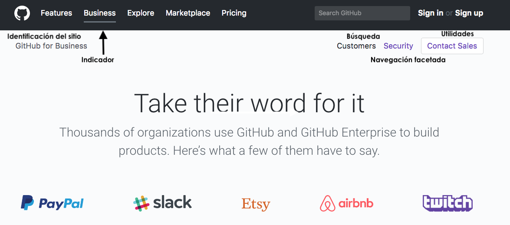

# Retos UX

### Descripción
### ***Laboratoria***

***Objetivo de Negocio:*** Atraer postulantes que se integren al programa

### Elementos de UX

1. En la página principal se denotan los elementos de Care, Do, See y Think.
2. Las imágenes están estrechamente relacionadas con el enfoque del producto.
3. Contiene un chat en la sección de postulación que te ayuda a resolver dudas durante el proceso.
4. Contiene descripciones de cada una de las secciones de la página.
5. Muestran historias de las egresadas así como de la fundadora.
6. Contiene información sobre los medios de comunicación en los que ha aparecido.
7. Brinda datos sobre el número de graduadas, las empresas empleadoras, el porcentaje de colocación laboral y miden el nivel de satisfacción de las empresas.
8. Llama mucho la atención el hecho de que contenga una imagen de la fundadora en un congreso junto a personalidades tan importantes como Barack Obama y el fundador de Facebook, Mark Zuckerberg . Adicional a la frase de “Es importante mencionar que la tasa de éxito de Laboratoria y ha sido extraordinaria” dicha por el ex.- residente de EUA, Barack Obama.
9. El incluir los logos de empresas mundialmente conocidas da seguridad, confianza y demuestra el nivel de éxito obtenido.
Se denota que es un programa de mujeres para mujeres, ya que la mayoría de las imágenes las muestran además de que se encuentran estudiando, programando, riéndose, divirtiéndose y trabajando en equipo.
10. Atrae a postularse por toda la información que contiene la página, desde las sentencias de “talento que transforma”, las explicaciones, los criterios de selección hasta los pasos para postularse.
11. El formulario de postulación es un poco largo pero puntual en los datos o preguntas  que solicita.
12. La navegación es sencilla, no se requiere de andar buscando entre los menús o las diversas páginas.
13. La interacción es la adecuada, en la mayoría de los casos funcionan los botones.
14. Es creíble, accesible y a pesar de que de primera vista no invita a postularse de manera inmediata, atrae nuevos miembros y clientes como las empresas.

### Elementos de UI

1. Contiene imágenes que  indican éxito, la culminación de un proceso (graduación), mujeres, felicidad, historias de éxito,  empresas relacionadas y que le apuestan al proyecto. Así como el impacto del proyecto y el grado del mismo.
2. Logos de las empresas con las que colaboran y de las organizaciones/empresas que les han otorgado reconocimientos.
3. La tipografía es la misma para títulos, subtítulos (“Montserrat”) y para párrafos (“Museo-sans-1”).
4. Los títulos y subtítulos están escritos en mayúsculas, los párrafos están en combinación, mayúsculas y minúsculas, como en las oraciones.
5. Los párrafos poseen una sangría que facilita su lectura.
6. La paleta de colores está basada en una combinación de color amarillo (mostaza), para los botones, detalles como líneas y para definir las secciones, blanco, usado para el texto en imágenes y negro para el contenido de manera general.
7. Los botones cambian de cursor a puntero pero no de color.
8. Los datos estadísticos se presentan en un tamaño grande, sin ser exagerado y con una leyenda de lo que hace referencia.
9. Los medios de comunicación en los cuales han aparecido.
10. Existe una sección de blog con artículos relacionados al programa, a la metodología usada (AGILE) y las experiencias de la fundadora.
11. En el pie de página contiene enlaces de contacto, de bolsa de trabajo y al blog.
12. Mientras se navega en la página, se despliega una barra fixed con los iconos de las redes sociales, los cuales enlazan a las mismas.
13. Posee un botón de “Estudiantes”, el cual direcciona a una nueva página donde se llena un formulario para postularse, al cual se accede dando clic en el botón de “Postula ahora”.
14. En la página de convocatoria, se encuentra la sección de preguntas frecuentes con información que se despliega al dar clic en un triángulo invertido.
15. Posee un icono de chat que despliega una ventana para iniciar una conversación con una caja de texto para introducir los mensajes y un botón de cerrar.
16. Al dar clic en el botón de “Empresas” direcciona a la página con este nombre, donde brinda la opción de suscribirse al dar clic a un botón (el cual actualmente no funciona).
17. Posee dos botones de “conoce más”, uno relacionado a los cursos que ofrece para las empresas y otro para contratar talento.
18. En la página de talento, se tiene un botón que dice “Conoce nuestro talento”, donde tiene menús de filtrado por Sede, ordenar por, filtrar por skills destacados así como un botón para postear una oferta.
19. Se despliega una pestaña con una pequeña encuesta, donde se selecciona la opción deseada y se da clic en el botón enviar.
20. En la página de empresas se tienen los logos de más empresas que han contratado talento Laboratoria.
21. Así como un video, que brinda información sobre el programa y un botón de “Explora nuestros contenidos”, que direcciona a una nueva página llamada “Medium/Laboratoria talks” donde se despliegan artículos que contienen imágenes, texto y videos. Adicional a un botón de “Get started”, un link de “Sign in” que permite suscribirse, un menú global, una barra con iconos de las redes sociales que direccionan a las mismas (tanto de manera lateral conforme bajas en la pantalla como en la parte inferior al finalizar el artículo),  tiene dos botones para “Follow” a la autora del artículo y a Laboratoria. Al final, se encuentran en bloques pequeñas miniaturas o visualizaciones de otros artículos relacionados con enlaces a los mismos, un área de texto para comentarios/preguntas y un pie de página con un botón para  suscribirse.

Los elementos en:
- Color azul representan “SEE”,  que son aquellos que con solo verlos transmiten algún sentimiento.
- los de color amarillo “Do”, invitan al usuario a interactuar con la página.
- los de color rojo “CARE”, son los que se relacionan con los usuarios encargados de proveerles servicio o información.
- y los de verde “THINK”, aquellos que añaden curiosidad o invitan a investigar al usuario.

***

***
### ***GitHub***

### Elementos de navegación

1. Navegación global, es el menú principal ya que contiene todos los accesos hacia los elementos tanto principales como adicionales de la página.
2. Contiene un campo de búsqueda.
3. Botones de acceso para registrarse o usuarios ya registrados.
4. Menú de navegación de pie de página, con links hacia sitios o secciones específicas.
5. Tiene links de referencia, elementos en línea para enlazar a otras páginas.
6. Además posee navegación contextual dado que brinda recomendaciones sobre otros sitios o aplicaciones.
7. Tiene navegación suplementaria, ya que indica elementos específicos a un nuevo usuario.
8. En la página de marketplace tiene una navegación localizada ya que ayuda al usuario a explorar dentro de las categorías de aplicaciones. Así mismo posee una navegación contextual ya que proporciona recomendaciones sobre diversas herramientas de utilidad.
9. En la página de explore, se tiene navegación suplementaria, dado que es adicional tanto de los productos como de otras partes de la página, navegación contextual donde se indican recomendaciones sobre otros temas relacionados y navegación facetada dado que se tienen filtros no editables sobre las colecciones, los elementos trending, etc.
10. La página permite observar casi todos los tipos de navegación a excepción de la navegación filtrada, ya que no brinda opciones de especificar una búsqueda.

En las siguientes imágenes se muestran los elementos de navegación, en distintas páginas del sitio.

***
### ***Sketch***

### Dashboard

El dashboar de acuerdo a los requerimientos de Laboratoria se muestra a continuación:

